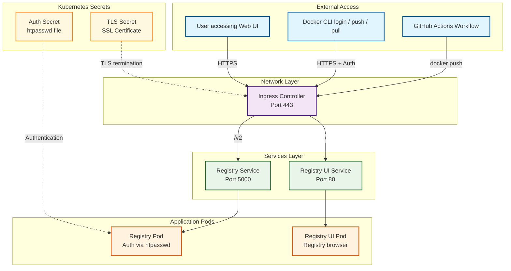

# 🔐 MicroK8s Docker Registry with HTTPS & Auth

This repository provides step-by-step Kubernetes YAMLs and scripts to deploy a private Docker Registry inside a MicroK8s cluster with:

- HTTPS enabled (via Let's Encrypt + Certbot)
- Basic authentication (`htpasswd`)
- Web UI (`docker-registry-ui`)
- Works well with GitHub Actions

## Directory Structure

```text
microk8s-registry-https/
├── README.md
├── registry
│   ├── registry-deployment.yaml
│   └── registry-service.yaml
├── registry-certbot.sh
├── registry-ingress.yaml
├── registry-ui
│   ├── registry-ui-deployment.yaml
│   └── registry-ui-service.yaml
└── renew-registry-cert.sh
````

## Setup Instructions

### Environment Configuration

Before running the scripts, you need to configure your environment variables

Copy the example environment file

```bash
cp env.example .env
```

Edit `.env` file with your actual values

> ⚠️ **Security Note**: The `.env` file is automatically ignored by git to prevent exposing sensitive information.

### 1. Deploy with Environment Variables

You can now deploy using the provided scripts that automatically handle environment variable substitution:

#### Option A: Render and apply separately

```bash
# Render YAML files with environment variables
./render-yaml.sh

# Apply the rendered files
kubectl apply -f rendered/
```

#### Option B: Render and apply in one step

```bash
# Apply directly with environment variable substitution
./apply.sh
```

### 2. Prerequisites

- A VPS with **MicroK8s**, **Docker**, and **Static IP**
- A domain pointing to your VPS (configure in `.env` file)
- Port **80** must be free temporarily during certificate issuance

### 3. Create namespace and authentication

```bash
microk8s kubectl create namespace container-registry
htpasswd -Bbn admin admin > auth.htpasswd
microk8s kubectl create secret generic registry-auth \
  --from-file=htpasswd=auth.htpasswd \
  -n container-registry
````

### 4. Deploy Registry and UI

```bash
microk8s kubectl apply -f registry/
microk8s kubectl apply -f registry-ui/
```

### 5. Issue HTTPS Certificate via Certbot

```bash
chmod +x registry-certbot.sh
./registry-certbot.sh
```

### 6. Deploy Ingress

```bash
microk8s kubectl apply -f registry-ingress.yaml
```

---

## Access

- 🐳 Docker Registry: `https://${REGISTRY_DOMAIN}/v2/`
- 🌐 Web UI: `https://${REGISTRY_DOMAIN}`

> Replace `${REGISTRY_DOMAIN}` with your actual domain configured in the `.env` file.

---

## 🔧 Architecture

Below is the architecture of the system including ingress, registry, UI and GitHub integration:



---

## 📌 Notes

- GitHub Actions can push to this registry with auth
- Renew TLS every 90 days (use cron or certbot auto-renew)
- You can switch to `cert-manager` later if needed

---

## 🛡️ Security

- Use strong password in `htpasswd`
- Consider setting up [HashiCorp Vault](https://www.vaultproject.io/) if secrets grow

---

## 🔁 Auto-Renew TLS Certificate

Let's Encrypt certificates expire every 90 days. You can automate renewal and secret update using the provided script.

### 1. Script: `renew-registry-cert.sh`

This script will:

- Run `certbot renew` with `--standalone`
- Temporarily disable and re-enable MicroK8s ingress
- Copy renewed certs and update the Kubernetes TLS secret

Ensure the script is executable:

```bash
chmod +x renew-registry-cert.sh
```

Or copy it to a global path:

```bash
sudo cp renew-registry-cert.sh /usr/local/bin/renew-registry-cert.sh
```

### 2. Schedule with Crontab

Edit root crontab:

```bash
sudo crontab -e
```

Add the following line to run every 3 months (on the 1st day at 2:00 AM):

```cron
0 2 1 */3 * /usr/local/bin/renew-registry-cert.sh >> /var/log/registry-cert-renew.log 2>&1
```

> 📌 **Note**: Port 80 must be free during renewal (disable ingress or ensure no conflict).
